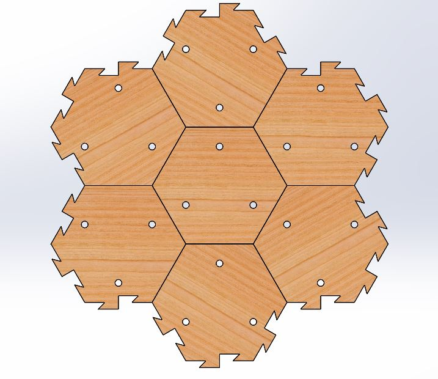
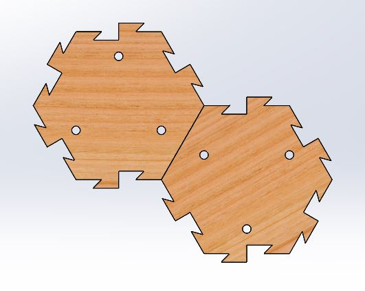

# Effect of Planning Depth in Predator-Prey Behavior
**Michael Wiznitzer**

Northwestern University: Final Project

## Introduction
Nature is a wonder of its own. When we look at animals, we usually see cute furry creatures that seemingly just do their own thing. After seeing them in the wild, though, you begin to notice how they use their environment to hunt or hide from other animals. For [example](https://youtu.be/LhSDxp0oQK8?t=2m51s), a leapord might hide in a narrow valley as it hunts imapla grazing above it. In order to better understand these predator-prey relationships, [research](https://nxr.northwestern.edu/planning-vertebrates) has been done in the NxR lab to simulate how prey will act (using POMDPs) given various planning depths in order to reach some goal position before a predator kills the prey. My project focuses on turning these simulations into a 3-D honeycomb-styled-world realization where Sphero robots act as the predator and prey that have to navigate in various levels of occluded environments.

####  Objective
The goal of this project is to demonstrate the effect of planning-depth in regards to prey being able to reach some goal position before the predator kills it in a 3-D honeycomb-styled-world environment with various levels of occlusion. This project breaks down into 3 different parts listed below:

- Maze Fabrication
- Sphero Control with ROS
- Image Processing to determine robot location in maze

To read more about each part, see my portfolio post [here](https://mechwiz.github.io/Portfolio/prey.html). This repo's purpose is to highlight all of the differenct modules designed and created for the **Maze Fabrication** part above.

## Maze Fabrication
There are two parts to designing the maze within which the 3-D simulations will occur. The obvious part is designing the full-scale maze which looks something like the picture below based on the specs described in my portfolio post.

 

The full-scale maze includes 349 hexagonal cells and is roughly 8ft long by 6.25ft wide by 0.5ft tall. Due to the large size of the maze, the pieces are modular so that assembly and takedown is relatively straightforward.

Before building the full-scale maze, a small-scale version was made so that testing with the other parts of the project (i.e. controlling the Sphero robots with ROS via Image Processing) could be done. This way, if any modificaitons to the small scale maze had to be done in the interest of the other parts, they could be incorporated into the full-scale maze design. These changes are discussed in the **Full Scale Maze Design** section.

### Small Scale Maze Design
The small-scale maze design assembly model and actual laser-cut model are shown side by side below:

CAD Model                                                                          | Laser-cut Model
:---------------------------------------------------------------------------------:|:---------------------------------------------------------------------------------:
 | 

The module pieces incorporated are described in the table below.

Description| CAD Model                                                                           | Laser-cut Model
:----------|:----------------------------------------------------------------------------------:|:----------------------------------------------------------------------------------:
Modular interlocking floor piece with 7 cells   (holes allow for obstacles to be "plugged" into the board via dowel pins) <ul><li>[DXF Files](small_scale_model/modules/module_7cell/dxf)</li><li>[SVG Files](small_scale_model/modules/module_7cell/svg)</li></ul>   _7 modules_ |  | 
Modular interlocking floor piece with 2 cells   (holes allow for obstacles to be "plugged" into the board via dowel pins) <ul><li>[DXF Files](small_scale_model/modules/module_2cell/dxf)</li><li>[SVG Files](small_scale_model/modules/module_2cell/svg)</li></ul>   _4 modules_ |  | 
Obstacle for blocking path of Sphero   (uses a press-fit design; dowel pins glued   on bottom are aligned with holes on the board) <ul><li>[DXF Files](small_scale_model/modules/obstacles/dxf)</li><li>[SVG Files](small_scale_model/modules/obstacles/svg)</li></ul>   _Number of modules can vary_ |      | 
Interlocking border piece with the floor and wall pieces <ul><li>[DXF Files](small_scale_model/modules/border/dxf)</li><li>[SVG Files](small_scale_model/modules/border/svg)</li></ul>   _6 modules_ |        | 
Modular wall that fits into the border pieces <ul><li>[DXF Files](small_scale_model/modules/walls/dxf)</li><li>[SVG Files](small_scale_model/modules/walls/svg)</li></ul>   _6 modules_ |          | 
Modular wall cover that secures the wall pieces together <ul><li>[DXF Files](small_scale_model/modules/wall_covers/dxf)</li><li>[SVG Files](small_scale_model/modules/wall_covers/svg)</li></ul>   _6 modules_ |   | 

### Full Scale Maze Design
The current full-scale maze design assembly model is shown below. Some modifications were made based on testing in the small-scale maze and due to size restrictions. There was no space available that could fit the maze with its original dimensions (11ft long by 8.6ft wide) so the cell size was reduced (where each side of the hexagon was changed from 3.5in to 2.5in) in order to maintain the same number of cells as required by spec. As such, the Sphero 2.0 was no longer an option as its diameter is roughly 3 inches. The Sphero Mini was chosen instead as its diameter is a little under 2 inches. Hence all full-scale module pieces were modified to reflect this change. The other change that will be implemented based on testing in the small-scale and full-scale mazes is that a clear vinyl mat will be spread out over the surface of the maze. This is because some of the wood pieces are slightly warped which makes some catch points near the module connections that could potentially inhibit movement of the Sphero Mini (something that wasn't an issue for the Sphero 2.0). The mat will help make a continous smooth surface that the Sphero Mini will be able to move on with no issue. It should also be noted that holes will be punched on the mat corresponding to the hole places on the wood surface of the maze. These holes will not inhibit the Sphero movement as the mat is very thin (around 0.4 mm). Also note that because each cell of the maze will be labeled using a labeling scheme, the holes will always line up with those on the mat.

The module pieces incorporated are described in the table below.

Description| CAD Model                                                                           | Laser-cut Model
:----------|:----------------------------------------------------------------------------------:|:----------------------------------------------------------------------------------:
Modular interlocking floor piece with 7 cells   (holes allow for obstacles to be "plugged" into the board via dowel pins) <ul><li>[DXF Files](full_scale_model_mini/modules/module_7cell/dxf)</li><li>[SVG Files](full_scale_model_mini/modules/module_7cell/svg)</li></ul>   _41 modules_ |  | 
Modular interlocking floor piece with 1 cell   (holes allow for obstacles to be "plugged" into the board via dowel pins) <ul><li>[DXF Files](full_scale_model_mini/modules/module_1cell/dxf)</li><li>[SVG Files](full_scale_model_mini/modules/module_1cell/svg)</li></ul>   _6 modules_ |  | 
Modular interlocking floor piece with 2 cells   (holes allow for obstacles to be "plugged" into the board via dowel pins) <ul><li>[DXF Files](full_scale_model_mini/modules/module_2cell/dxf)</li><li>[SVG Files](full_scale_model_mini/modules/module_2cell/svg)</li></ul>   _2 modules_ |  | 
Modular interlocking floor piece with 3 cells   (holes allow for obstacles to be "plugged" into the board via dowel pins) <ul><li>[DXF Files](full_scale_model_mini/modules/module_3cell/dxf)</li><li>[SVG Files](full_scale_model_mini/modules/module_3cell/svg)</li></ul>   _4 modules_ |  | 
Modular interlocking floor piece with 5 cells   (holes allow for obstacles to be "plugged" into the board via dowel pins) <ul><li>[DXF Files](full_scale_model_mini/modules/module_5cell/dxf)</li><li>[SVG Files](full_scale_model_mini/modules/module_5cell/svg)</li></ul>   _8 modules_ |  | 
Obstacle for blocking path of Sphero   (uses a press-fit design; dowel pins glued   on bottom are aligned with holes on the board) <ul><li>[DXF Files](full_scale_model_mini/modules/obstacles/dxf)</li><li>[SVG Files](full_scale_model_mini/modules/obstacles/svg)</li></ul>   _Number of modules can vary_ |      | 
Interlocking border piece with the floor and wall pieces <ul><li>[DXF Files](full_scale_model_mini/modules/border_4cell_left/dxf)</li><li>[SVG Files](full_scale_model_mini/modules/border_4cell_left/svg)</li></ul>   _6 modules_ |  | 
Interlocking border piece with the floor and wall pieces <ul><li>[DXF Files](full_scale_model_mini/modules/border_4cell_right/dxf)</li><li>[SVG Files](full_scale_model_mini/modules/border_4cell_right/svg)</li></ul>   _6 modules_ |  | 
Interlocking border piece with the floor and wall pieces <ul><li>[DXF Files](full_scale_model_mini/modules/border_2cell/dxf)</li><li>[SVG Files](full_scale_model_mini/modules/border_2cell/svg)</li></ul>   _4 modules_ |  | 
Modular wall that fits into the border pieces <ul><li>[DXF Files](full_scale_model_mini/modules/wall_4cell/dxf)</li><li>[SVG Files](full_scale_model_mini/modules/wall_4cell/svg)</li></ul>   _12 modules_ |          | 
Modular wall that fits into the border pieces <ul><li>[DXF Files](full_scale_model_mini/modules/wall_2cell/dxf)</li><li>[SVG Files](full_scale_model_mini/modules/wall_2cell/svg)</li></ul>   _4 modules_ |          | 
Modular wall cover that secures the wall pieces together <ul><li>[DXF Files](full_scale_model_mini/modules/wall_corner_covers_4cell/dxf)</li><li>[SVG Files](full_scale_model_mini/modules/wall_corner_covers_4cell/svg)</li></ul>   _4 modules_ |   | 
Modular wall cover that secures the wall pieces together <ul><li>[DXF Files](full_scale_model_mini/modules/wall_corner_covers_2cell/dxf)</li><li>[SVG Files](full_scale_model_mini/modules/wall_corner_covers_2cell/svg)</li></ul>   _4 modules_ |   | 
Modular wall cover that secures the wall pieces together <ul><li>[DXF Files](full_scale_model_mini/modules/wall_middle_covers_4cell/dxf)</li><li>[SVG Files](full_scale_model_mini/modules/wall_middle_covers_4cell/svg)</li></ul>   _6 modules_ |   | 
Modular wall cover that secures the wall pieces together <ul><li>[DXF Files](full_scale_model_mini/modules/wall_middle_covers_2cell/dxf)</li><li>[SVG Files](full_scale_model_mini/modules/wall_middle_covers_2cell/svg)</li></ul>   _2 modules_ |   | 

### Part Modifications
An ultimate goal of the project is to have a mouse be chased around by a Sphero and to analyze the path that the mouse takes so that our predator-prey path models can be verified and/or updated. Since mice can jump fairly high (even higher than the current 0.5ft height of the maze), a plexiglass cover (such as 2 pieces of [this](https://www.homedepot.com/p/OPTIX-48-in-x-96-in-x-1-8-in-Clear-Acrylic-Sheet-MC-100S/205351353) along the length of the maze) can be set over the maze to prevent any mice from jumping over obstacles and walls. The cover can be supported by the walls of the maze and any obstacles within. In the event that this affects how the mice will plan, an alternative approach (though much more involving) is to make modifications to the wall components within the maze as described in the following procedure:

1. Open up the following part files in Solidworks:
  - [wall_2cell](full_scale_model_mini/modules/wall_2cell/wall_2cell_mult.SLDPRT)
  - [wall_4cell](full_scale_model_mini/modules/wall_4cell/wall_4cell_mult.SLDPRT)
  - [obstacle_wall_mult](full_scale_model_mini/modules/obstacles/obstacle_wall_mult.SLDPRT)
2. Change the height dimension in their corresponding sketches from 6 inches to however many inches are desired
3. Save the files as dxf files (from the top plane)
4. Import these files into Inkscape, and save them as svg files
5. Using a laser cutter, cut out the newly updated walls
  - For the **wall_2cell** and **wall_4cell** walls, use [1/4 inch 20"x30" birch plywood](https://www.woodworkerssource.com/shop/product/14balpack3.html)
  - For the **obstacle_wall** walls, use [1/8 inch 20"x30" birch plywood](https://www.woodworkerssource.com/shop/product/18balpack3.html)
6. Replace the shorter walls with the taller walls
  - Just a fair warning, this may be tedious work when it comes to the obstacles. You will first need to remove the current walls using a flat-head screwdriver as a lever since the obstacles have a press-fit design. You will then need to install the new walls as described [here](obstacle_procedure.md))
