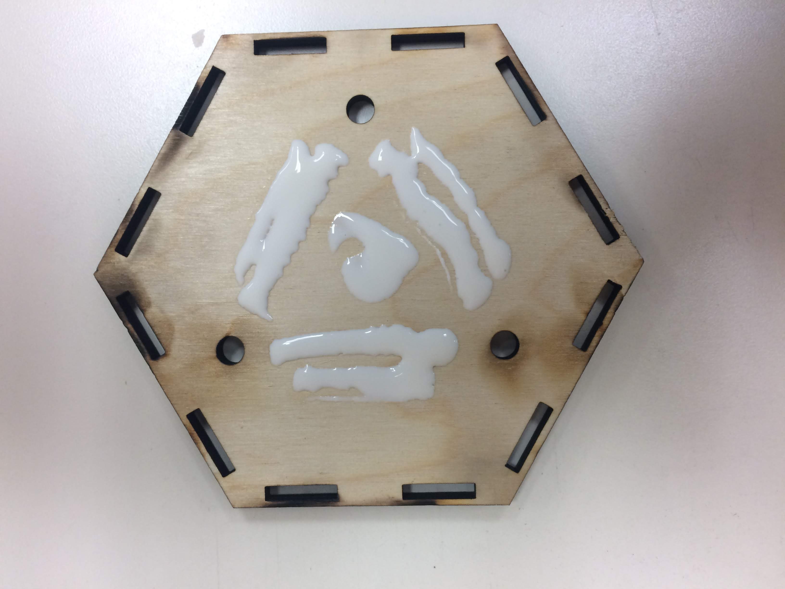
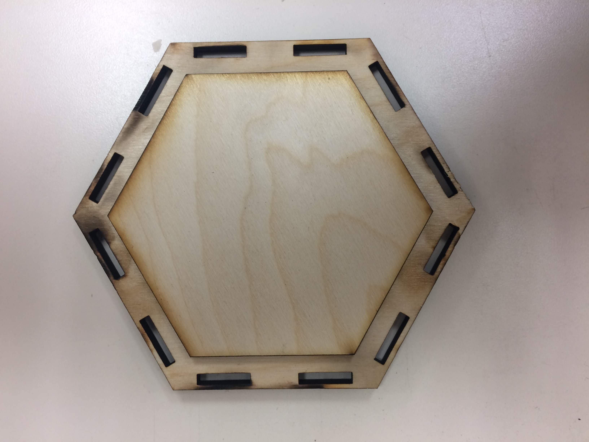
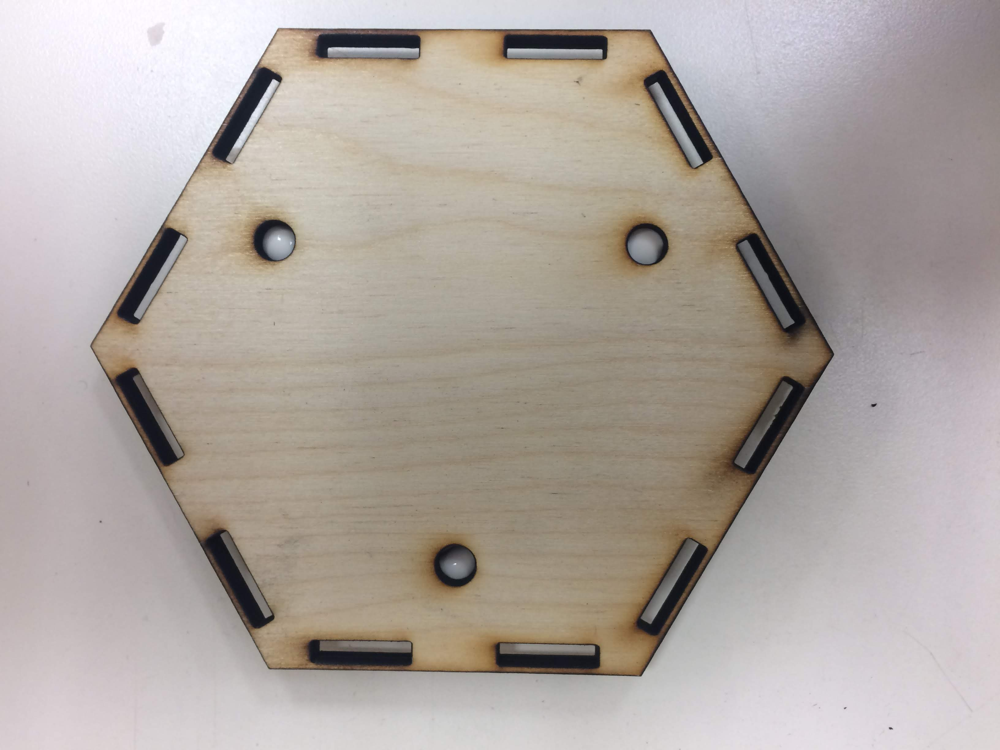
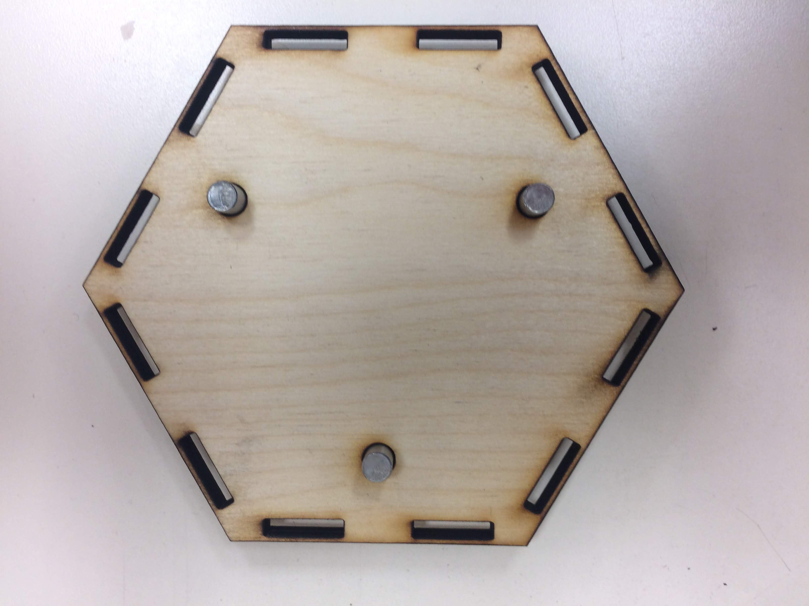
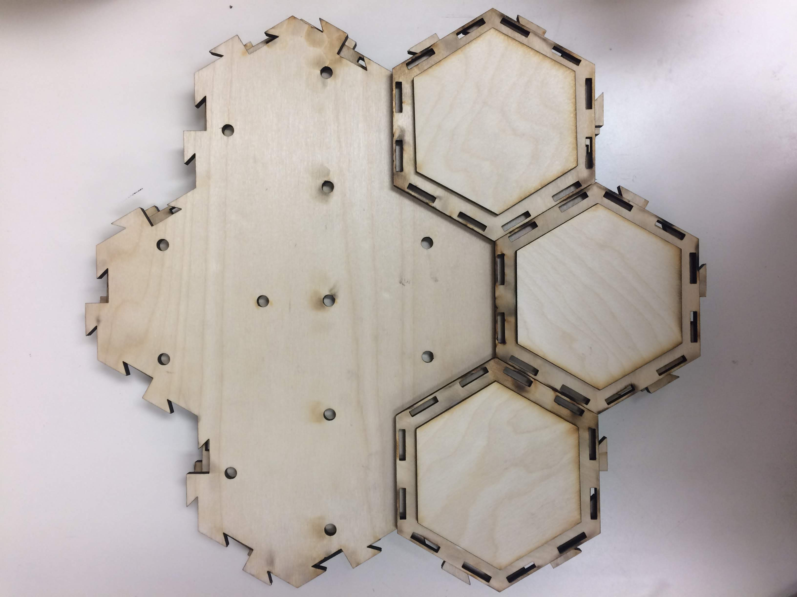
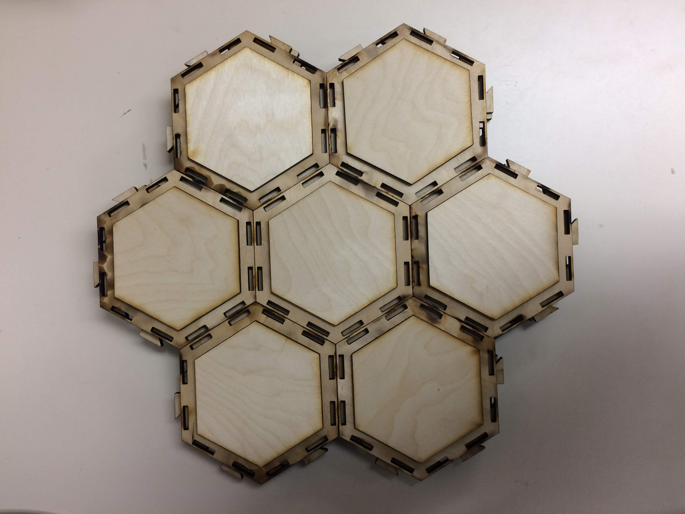
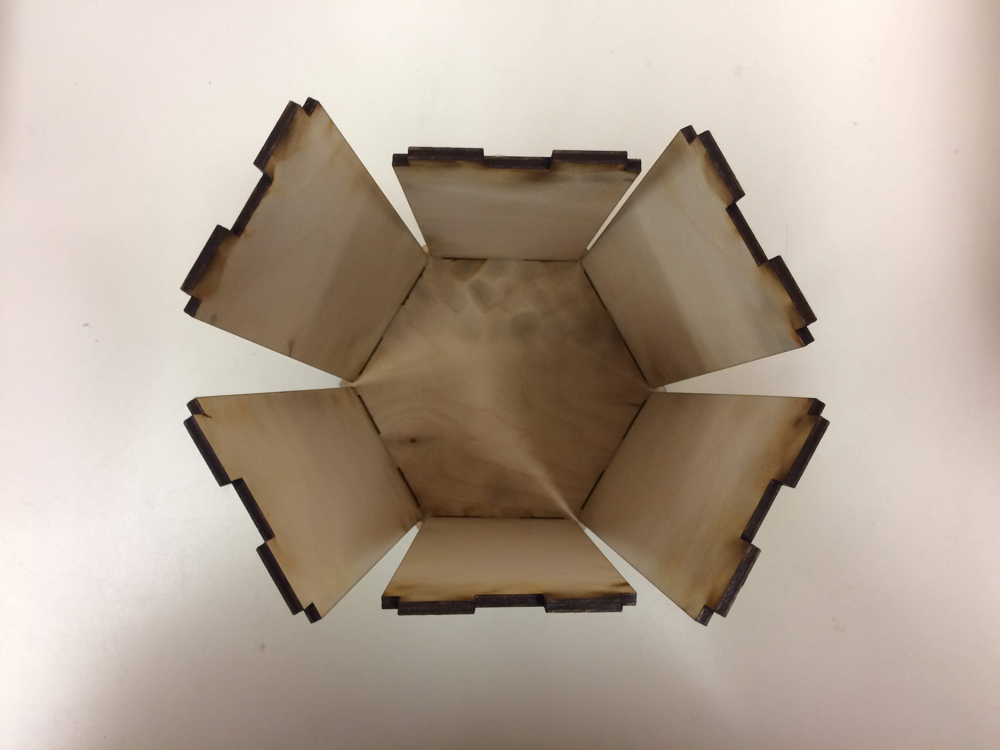
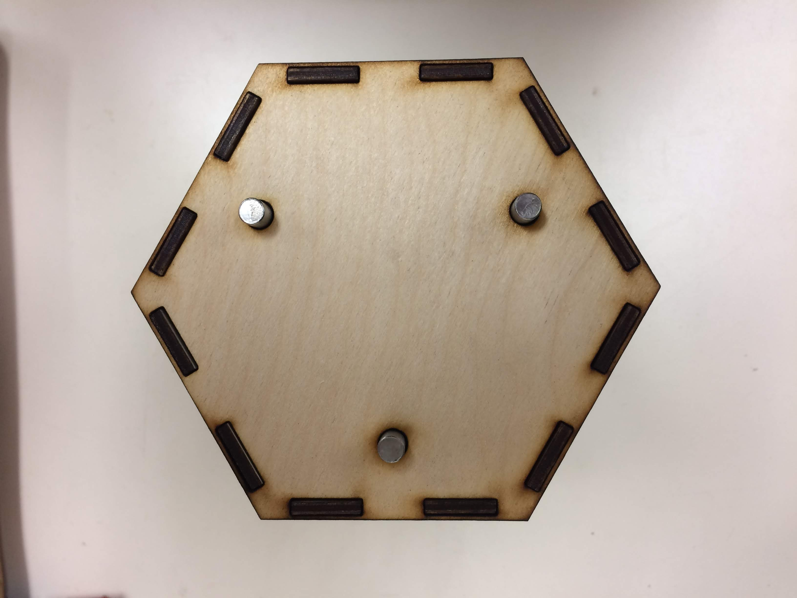

# Effect of Planning Depth in Predator-Prey Behavior
**Michael Wiznitzer**

Northwestern University: Final Project

## Obstacle Building Procedure

#### Obstacle Parts
Each obstacle consists of the following parts:
- [Obstacle Base](full_scale_model_mini/modules/obstacles/svg/obstacle_base.svg)
- [Obstacle Cover](full_scale_model_mini/modules/obstacles/svg/obstacle_cover.svg)
- [Obstacle Securing Piece](full_scale_model_mini/modules/obstacles/svg/obstacle_secure.svg)
- 6 [Obstacle Walls](full_scale_model_mini/modules/obstacles/svg/obstacle_wall.svg)
- 3 [dowel pins](https://www.mcmaster.com/90145a537)

If you would like to cut out multiple parts at one time, you can use the svg files where "\_mult" is added on to the file name. The rule of thumb for laser-cutting these files is to cut out the blue-lines on the first pass, and the black lines on the next pass.

#### Obstacle Building Procedure
1. Take an obstacle base and lay it down so that the nice side is touching the table. Then add some wood glue as shown below.

2. Take an obstacle securing piece and place it on the glue as shown. Press down firmly on it.

3. Flip the glued obstacle base over.

4. Put a drop of glue into each of the holes

5. Place 1 dowel pin firmly into each of the holes and wipe any glue that spills out of the hole

6. Place the obstacle base onto an upside down 7-cell modular piece to dry as shown. Wipe any glue that formed around the lip of the securing piece.

7. Depending on how many obstacles you are making, fill the 7-cell modular piece to its capacity. Then place some heavy books on it so that the glue can dry on the pieces while they are being pressed together. Wait for an hour or two.

8. Take an obstacle cover and flip it so that the nice side is touching the table. Place walls into each of the 6 spots on the cover as shown. Make sure the nice sides are facing towards the outside of the obstacle.

9. Using a mallet, and some finger dexterity, take a now dry glued obstacle base and position it so that the obstacle wall inserts are right below their corresponding holes on the obstacle base. Hammer in the base into the wall inserts as shown.

